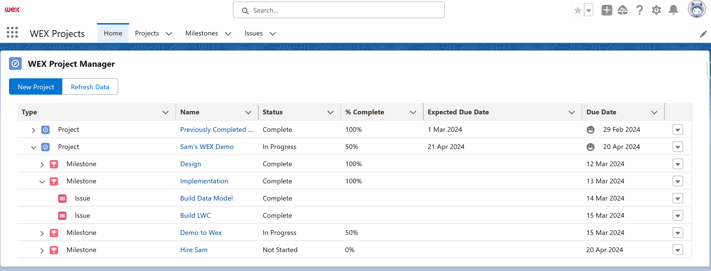

# Wex-Project-Management

## Introduction
This Lightning Web Component is designed for Salesforce to help manage projects, milestones, and issues in a hierarchical, easy-to-navigate interface. It provides Salesforce users with a comprehensive overview of project progress, including status updates, owner details, and completion percentages, directly within their Salesforce environment using the Wex Project Management Application.

## Features
- Create Projects, Milestones, and Issues.
- Track completion percentagage across all your projects.
- Easily manage issues in an easy to use interface.

## Screenshot

### Application Home

### Data Model

### LWC Component Diagram

## Installation Guide
To use this app, follow these steps:
#### 1. Install unlocked package:
[Package Install Link (Sandbox Only)](https://login.salesforce.com/packaging/installPackage.apexp?p0=04tQy0000000niHIAQ)

#### 2. Setup Permissions
- **Project Manager Permission Set**: Assign this permission set to users who need full access to create, modify, and delete projects, milestones, and issues.
- **Project Read Only Permission Set**: Assign this to users requiring view-only access to projects, milestones, and issues.

#### 3. Navigate to the "Wex Projects" Lightning Application

#### 4. Create projects, milestones and issues.

The home tab contains the Project Manager LWC.
    1. Click the blue button "Create Project" to create a new project.
    
    2. Enter a Project Name in the Modal that appears and click Save.
    
    3. You will then be directed to the new project record. You can create milestones here, but that's no fun! 
    
    4. Navigate back to the "Home" tab, and click the action dropdown next to our newly created project.
    
    5. This will launch the new Milestone modal. Enter all relevant information here and click save.
    
    6. You will be directed to the new milestone record. Navigate back to the home tab and expand the new project, and find the milestone we just created.
    7. Click on the action dropdown next to the milestone and click "Create Issue"
    
    8. This will, you guessed it, open the New Issue modal. Fill in all fields and click Save.
    
    9. Navigate back to the home tab, and click on the action button next to our newly created issue. You'll be able to change the issue's progress as you wish.
    
    10. Issues roll up to the parent milestone status. Milestone completion rolls up to the project status. When all issues and milestones are complete, the project will complete!
    
    11. Congratulations! You're ready to tackle some projects.

### Adding the Component to a new Page
1. Navigate to the Lightning App Builder.
2. Select the page you wish to add the Project Manager LWC to or create a new one.
3. Drag the Project Manager LWC from the list of available components to your desired location on the page.
4. Save and activate the page.

